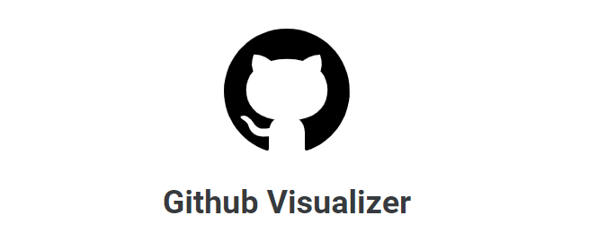

<h1 align="center">
    
</h1>

<h4 align="center">
  🚀 Github Visualizer
</h4>

  

  
  
  

  

  <a href="#rocket-tecnologias">Tecnologias</a>&nbsp;&nbsp;&nbsp;|&nbsp;&nbsp;&nbsp;
  <a href="#-projeto">Projeto</a>&nbsp;&nbsp;&nbsp;|&nbsp;&nbsp;&nbsp;
  <a href="#clipboard-documentação">Documentação</a>&nbsp;&nbsp;&nbsp;|&nbsp;&nbsp;&nbsp;
  <a href="#uso-de-ferramentas-no-código">Ferramentas</a>

 

  

## :rocket: Tecnologias

Esse projeto foi desenvolvido com:

- [React](https://reactjs.org)
- [Figma](https://www.figma.com/file/O8xkvke8TAMm24vxbhoecM/Github-Visualizer)

## 💻 Projeto

O Github Visualizer permite que você busque e gerencie novas organizações dentro do github, e interaja com elas visualizando e buscando por seus repositórios!

## :clipboard: Documentação

Aqui irei citar de forma geral as ferramentas utilizadas, e o motivo para o uso, dando um contexto geral no por quê de cada coisa:

- **Figma** - Antes de iniciar o projeto, queria ter certeza da imagem que eu queria passsar para o mesmo, e nada mais útil e eficaz do que usar o Figma para garantir a qualidade inicial. Através desse [Link](https://www.figma.com/file/O8xkvke8TAMm24vxbhoecM/Github-Visualizer?node-id=0%3A1) é possível visualizar um pouco do esqueleto feito antes de colocar a mão na massa e codar!

- **ReactJS** - Através dele é possível criarmos aplicações performáticas seguindo o conceito SPA e melhorar a estruturação através da bagagem nessa biblioteca.

## Uso de Ferramentas no código

- **Formik** - Mesmo que nesse momento pareça "matar uma formiga com uma bazooka", quis apresentar para mostrar como é fácil utilizar, e garantir que caso esse projeto tenha novas funcionalidades, será possível escalar de maneira fácil e com qualidade através dessa biblioteca. Junto a ela, utilizei também o Yup, para garantir de forma geral a estrutura que os dados virão.

- **Styled Components** - Através dessa biblioteca eu consigo garantir a qualidade da estilização usando Javascript, podendo gerenciar props, hierarquias e muito mais. Pra ajudar na estrutura, optei por uso de tipografia, breakpoints e cores na aba styles baseadas no material-ui para garantir a qualidade e escalabilidade do mesmo.

- **Lottie** - O uso dessa biblioteca se deu por adicionar gifs em JSON, de uma forma que se apresente muito performática.

- **React-Helmet** - Pra dar um "charme" e gerenciar os titulos tanto do aplicativo principal quanto das organizações ao acessá-las, trazendo usabilidade e melhoria na experiência de usuário.

- **Axios** - Através do Axios, pude consumir a API do Github sem precisar trabalhar de uma maneira "vanilla", mas que ainda garante performance e agilidade no processo.

- **Cypress** - Para garantir a qualidade do código e se está tudo funcionando conforme o planejado, estruturei testes end-to-end no projeto para garantir que tanto a API quanto o client estão se comunicando da maneira que deveriam.

- **React Router Dom** - Para garantir a paginação e estruturação performática de um SPA.

- **React Icons** - Para garantir a qualidade na interface, optei pelo React Icons por trazer aquela "cara" mais profissional ao projeto.

